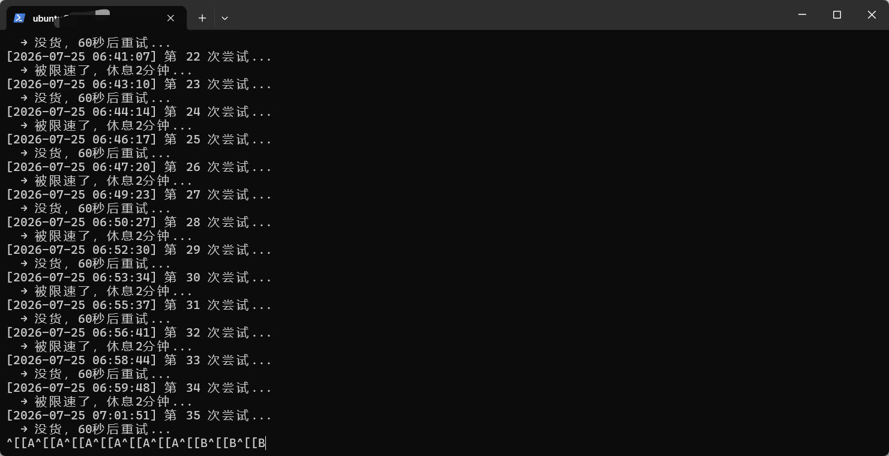
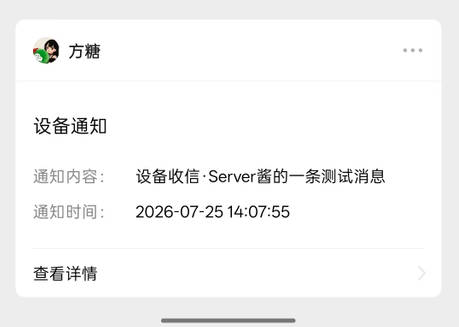

# Free Oracle ARM Skill

[](README.md)
[](README_EN.md)
[](LICENSE)
[](https://github.com/gokuscraper/free-oracle-arm-skill)
[](#)

> **在 Oracle Cloud Free Tier 上自动抢 ARM 实例。** 引导你完成从环境准备、OCI CLI 配置、部署抢机脚本、微信通知，到抢到后的备份与防回收的全流程。

---

## 这是什么？

<p align="center">
  
  <br>
  <em>抢机脚本自动运行，每60秒轮询一次，直到抢到为止</em>
</p>

<p align="center">
  
  <br>
  <em>抢到后通过 Server酱 实时推送到微信</em>
</p>

一个 **AI agent skill**，让 Claude Code、OpenClaw、Cursor、Codex、Gemini CLI 等 AI 助手具备自动抢 Oracle Cloud 免费 ARM 实例的能力。

Oracle Cloud 的 Always Free 层提供 Ampere A1（ARM）实例，目前免费额度为 **2 OCPU / 12 GB 内存 / 200 GB 存储**（2026年6月起新政策）。由于热门区域资源紧张，手动创建经常会遇到 `Out of host capacity`。

---

## 为什么用 Skill 而不是手动抢？

| | 手动刷新网页 | 用这个 Skill |
|---|---|---|
| **耗时** | 需要盯着屏幕，24小时不敢关机 | 提交一次，AI 在后台自动跑 |
| **技术要求** | 需要懂 OCI 控制台、SSH、Linux | 零基础，AI 每一步带着操作 |
| **成功率** | 人不可能24小时守着，错过释放 | 每60秒自动重试，不放过任何机会 |
| **通知** | 不知道什么时候抢到了 | 抢到后 Server酱 推送微信 |

---

## 工作原理

```
用户提供 Oracle 区域 + 配置信息
      ↓
AI 引导安装 OCI CLI + 配置 API 密钥
      ↓
部署 grab_arm.sh 到 Linux 服务器
      ↓
每 60 秒 → OCI API 查询可用容量 → 有？→ 创建实例 → Server酱 推送到微信
                ↓ 无
            等待 60 秒后重试
```

整个过程完全自动化，AI 会告诉你每一步的命令和操作。

---

## 为什么使用这个 Skill？

- ✅ **全自动化** — AI 引导你一步步操作，不需要手动研究文档
- ✅ **60秒轮询** — 脚本每隔60秒自动重试，不放过任何释放的容量
- ✅ **微信通知** — 抢到后通过 Server酱 实时推送到微信
- ✅ **防回收** — 内置 CPU 占用脚本，降低被 Oracle 回收的风险
- ✅ **零基础友好** — 不需要 SSH 或 Linux 经验，AI 全程带着你操作

---

## 安装

### OpenClaw（推荐）

```bash
clawhub install free-oracle-arm-skill
```

或在 OpenClaw 聊天室中搜索：

> "Install the free oracle arm skill from clawhub"

### Claude Code

```bash
npx skills i gokuscraper/free-oracle-arm-skill
```

### 其他 AI 助手（Cursor、Codex、Gemini CLI、Windsurf）

```bash
# 通用安装器 — 自动识别你的 AI 助手
npx skills i gokuscraper/free-oracle-arm-skill
```

### openskills

```bash
npx openskills install gokuscraper/free-oracle-arm-skill
```

### 手动

将 `free-oracle-arm-skill/` 目录放入项目的 `.agents/skills/` 文件夹中。

---

## 使用方法

加载 skill 后，AI 会自动引导你操作。你只需要根据 AI 的提示提供信息即可。**即使你完全不懂 Linux 或 SSH，AI 也会告诉你每一步该怎么做。**

## 先决条件

- 一个 [Oracle Cloud Free Tier](https://www.oracle.com/cloud/free/) 账号（免费注册）

> 不需要任何技术基础。没有 Linux 机器？AI 会引导你用甲骨文赠送的免费实例。不会 SSH？AI 会教你。一切从零开始。

## 项目结构

```
free-oracle-arm-skill/
├── SKILL.md              ← AI 指令文件
├── README.md             ← 中文说明
├── README_EN.md          ← English README
└── scripts/
    └── grab_arm.sh       ← 抢机脚本（可直接使用）
```

## 常见问题

**问：一定要有 Linux 机器才能用吗？**

是的。抢机脚本需要在 Linux 服务器上持续运行（每60秒轮询一次）。但如果你没有，AI 会引导你在甲骨文免费赠送的 E2.1.Micro 实例上操作。

**问：需要安装 OCI CLI 吗？**

AI 会自动引导你完成安装和配置，不需要提前准备。

**问：我完全不懂 Linux 和 SSH，能用吗？**

当然可以。这个 Skill 就是为零基础用户设计的。AI 会一步一步告诉你每一条命令、每一个操作该怎么做。

**问：每次抢机需要多久？**

不一定。热门区域（如大阪、首尔）可能需要几天甚至几周。冷门区域可能几分钟就抢到。脚本会一直重试直到成功。

**问：抢到的 ARM 实例会被回收吗？**

Oracle 可能会回收长期空闲的 ARM 实例。脚本内置了轻量 CPU 占用功能，可以降低被回收的风险。

**问：抢机脚本会消耗很多资源吗？**

不会。脚本本身很轻量，只是每60秒调用一次 OCI API。CPU 占用脚本也非常轻量。

---

## License

MIT

---

*Keywords: oracle cloud free tier arm instance grabber, 甲骨文免费ARM实例, 甲骨文云抢机, oci arm autograb, oracle always free arm script, AI skill oracle cloud, 甲骨文ARM脚本, free oracle vps grabber*
